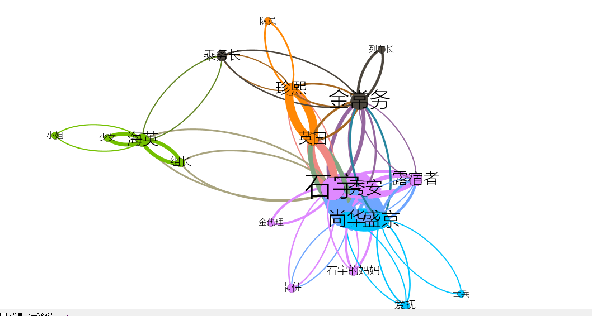

Title         : 第九周周报
Author        : zelig
Logo          : True

# 模拟登陆
利用python第三方库，模拟登陆信息门户：

1.首先分析登陆的请求：


**其中黄色为账号与密码；**

2.利用python写代码构建post请求；

code：
```
import requests
from bs4 import BeautifulSoup
import re
import urllib.request
loginurl = 'http://my.zzuli.edu.cn/userPasswordValidate.portal'
headers = {
    'User-Agent': 'Mozilla/5.0 (Windows NT 10.0; Win64; x64) AppleWebKit/537.36 (KHTML, like Gecko) Chrome/54.0.2840.71 Safari/537.36',
    'Cookie': 'Hm_lvt_1e7bb0586b7e61911a64e086492a7916=1477624531; Hm_lpvt_1e7bb0586b7e61911a64e086492a7916=1477624531; _ga=GA1.3.297408136.1477624531; _gat=1; JSESSIONID=00009jL4YpBHimeCREM4FNAcem5:164h0btfq',
    'Accept': 'text/html,application/xhtml+xml,application/xml;q=0.9,image/webp,*/*;q=0.8',
    'Accept-Encoding': 'gzip, deflate',
    'Accept-Language': 'zh-CN,zh;q=0.8'
}
data = {
    'Login.Token1': '541510020140',
    'Login.Token2': 'password',
    'goto': 'http://my.zzuli.edu.cn/loginSuccess.portal',
    'gotoOnFail': 'http://my.zzuli.edu.cn/loginFailure.portal'
}
s = requests.Session()
#发起对话
s.post(loginurl, data=data, headers=headers, verify=False)
#用post方法来登陆
html = s.get('http://my.zzuli.edu.cn/index.portal?.pn=p461_p462')
soup = BeautifulSoup(html.text, "html.parser")

print(soup)
}
```

3.对于知乎和新浪微博等网站的模拟登陆，有难度，其密码都经过加密，请求隐藏的很深；

对加密方法无知；

#文本人物关系分析
利用python，**对一个剧本的中的人物的关系的分析**，并用gephi工具进行绘图：

```
import jieba
import codecs
import jieba.posseg as pesg

names = {}
# 保存人物，该字典的键为人物名称，值为该人物在全文中出现的次数
relationships = {}
# 保存人物关系的有向边，该字典的键为有向边的起点，值为一个字典edge，edge的键是有向边的终点，值是有向边的权值，代表两个人物之间联系的紧密程度
lineNames = []
# 是一个缓存变量，保存对每一段分词得到当前段中出现的人物名称，lineName[i]是一个列表，列表中存储第i段中出现过的人物。
jieba.load_userdict("C:/Users/ricaito/Desktop/dict.txt")
# 加载字典
with codecs.open("C:/Users/ricaito/Desktop/busan.txt", 'r', 'utf8') as f:
    for line in f.readlines():
        poss = pesg.cut(line)
        # 分词并返回词性，nr为人名
        lineNames.append([])
        # 为新读入的一段添加人物名称列表
        for w in poss:
            if w.flag != 'nr' or len(w.word) < 2:
                # 当分词长度小于2或该词词性不为nr时认为该词不为人名
                continue
            lineNames[-1].append(w.word)
            # 为当前段的环境增加一个人物,lineNames为每段人物的关系
            if names.get(w.word) is None:
                # names为姓名字典，字典的get的方法获取键的值，不存在的新建
                names[w.word] = 0
                relationships[w.word] = {}
                # relationships为关系字典，不存在的新建
            names[w.word] += 1
            # 该人物出现次数加 1

for line in lineNames:
    # 每一段中，lineNames字典中是由列表组成，每个列表为一段
    for name1 in line:
        for name2 in line:
            # 每段中的任意两个人
            if name1 == name2:
                continue
            if relationships[name1].get(name2) is None:
                # name2键的值
                # 若两人尚未同时出现则新建项
                relationships[name1][name2] = 1
            else:
                relationships[name1][name2] = relationships[name1][name2] + 1
                # 两人共同出现次数加 1
with codecs.open("C:/Users/ricaito/Desktop/buran_node.txt", 'w', 'gbk') as f:
    f.write("Id Label Weight\r\n")
    for name, times in names.items():
        f.write(name + " " + name + " " + str(times) + "\r\n")

with codecs.open("C:/Users/ricaito/Desktop/buran_edge.txt", 'w', 'gbk') as f:
    f.write("Source Target Weight\r\n")
    for name, edges in relationships.items():
        for v, w in edges.items():
            if w > 3:
                f.write(name + " " + v + " " + str(w) + "\r\n")
}

```
利用gephi绘图如下：



人物关系；

#something
了解Django的一些基本知识；

尝试写一个小Django的应用，了解模板语言；

对网站的后台有一个大致的了解；

matlab的学习与可视化；

#下周

了解基本的rapidminer的操作；

向前推进R语言；

好好学习英语；


**学习是我快乐；**

